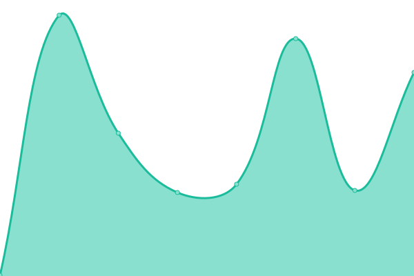

# [📈 Live Status](https://status.encrypt0r.my.id): <!--live status--> **🟧 Partial outage**

This repository contains the open-source uptime monitor and status page for [W. Syafiuddin](https://encrypt0r.my.id/), powered by [Upptime](https://github.com/upptime/upptime).

With [Upptime](https://upptime.js.org), you can get your own unlimited and free uptime monitor and status page, powered entirely by a GitHub repository. We use [Issues](https://github.com/its0din-ai/uptime-stats/issues) as incident reports, [Actions](https://github.com/its0din-ai/uptime-stats/actions) as uptime monitors, and [Pages](https://status.encrypt0r.my.id) for the status page.

<!--start: status pages-->
<!-- This summary is generated by Upptime (https://github.com/upptime/upptime) -->
<!-- Do not edit this manually, your changes will be overwritten -->
<!-- prettier-ignore -->
| URL | Status | History | Response Time | Uptime |
| --- | ------ | ------- | ------------- | ------ |
|  [Main Sites](https://encrypt0r.my.id) | 🟩 Up | [main-sites.yml](https://github.com/its0din-ai/uptime-stats/commits/HEAD/history/main-sites.yml) | 

 434ms
     
 | 

<a href="https://status.encrypt0r.my.id/history/main-sites">100.00%</a>
    

|  ID Arsenal-1 [🇮🇩] | 🟩 Up | [id-arsenal-1.yml](https://github.com/its0din-ai/uptime-stats/commits/HEAD/history/id-arsenal-1.yml) | 

 216ms
     
 | 

<a href="https://status.encrypt0r.my.id/history/id-arsenal-1">100.00%</a>
    

|  ID WAN [🇮🇩] | 🟩 Up | [id-wan.yml](https://github.com/its0din-ai/uptime-stats/commits/HEAD/history/id-wan.yml) | 

 219ms
     
 | 

<a href="https://status.encrypt0r.my.id/history/id-wan">100.00%</a>
    

|  JP Server [🇯🇵] | 🟥 Down | [jp-server.yml](https://github.com/its0din-ai/uptime-stats/commits/HEAD/history/jp-server.yml) | 

 168ms
     
 | 

<a href="https://status.encrypt0r.my.id/history/jp-server">54.69%</a>
    

|  [CyberChef](https://chef.encrypt0r.my.id) | 🟩 Up | [cyber-chef.yml](https://github.com/its0din-ai/uptime-stats/commits/HEAD/history/cyber-chef.yml) | 

 1069ms
     
 | 

<a href="https://status.encrypt0r.my.id/history/cyber-chef">100.00%</a>
    

|  [Blogs](https://blog.encrypt0r.my.id) | 🟩 Up | [blogs.yml](https://github.com/its0din-ai/uptime-stats/commits/HEAD/history/blogs.yml) | 

 194ms
     
 | 

<a href="https://status.encrypt0r.my.id/history/blogs">100.00%</a>
    

|  [Ethereum Gateway](https://eth.encrypt0r.my.id) | 🟩 Up | [ethereum-gateway.yml](https://github.com/its0din-ai/uptime-stats/commits/HEAD/history/ethereum-gateway.yml) | 

 356ms
     
 | 

<a href="https://status.encrypt0r.my.id/history/ethereum-gateway">100.00%</a>
    

|  [Microsoft Activation Scripts (MAS) Mirror](https://scripts.encrypt0r.my.id/mas) | 🟩 Up | [microsoft-activation-scripts-mas-mirror.yml](https://github.com/its0din-ai/uptime-stats/commits/HEAD/history/microsoft-activation-scripts-mas-mirror.yml) | 

 275ms
     
 | 

<a href="https://status.encrypt0r.my.id/history/microsoft-activation-scripts-mas-mirror">100.00%</a>
    

<!--end: status pages-->

[**Visit our status website →**](https://status.encrypt0r.my.id)

## 📄 License

- Powered by: [Upptime](https://github.com/upptime/upptime)
- Code: [MIT](./LICENSE) © [Anand Chowdhary](https://anandchowdhary.com), supported by [Pabio](https://pabio.com)
- Data in the `./history` directory: [Open Database License](https://opendatacommons.org/licenses/odbl/1-0/)
